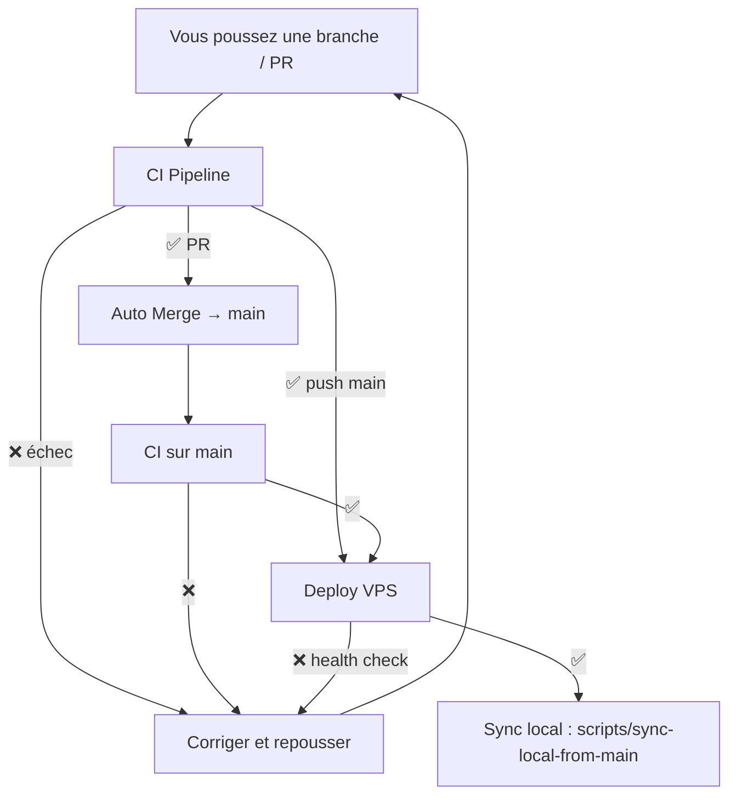

# Chaîne CI/CD automatisée — Mobility Health

Objectif : **vous ne gérez que le code** ; le reste (tests, merge, déploiement) est automatique.

## Flux automatique



| Étape | Déclencheur | Workflow | Action |
|-------|-------------|----------|--------|
| 1 | Push branche | — | Vous codez et poussez |
| 2 | PR ouverte | `ci.yml` | Tests backend, frontend, Flutter, Docker |
| 3 | CI vert sur PR | `auto-merge.yml` | Fusion automatique dans `main` |
| 4 | Push sur `main` | `ci.yml` | Re-validation sur main |
| 5 | CI vert sur main | `deploy.yml` | Déploiement VPS + health check |
| 6 | Deploy OK | — | `./scripts/sync-local-from-main.sh` sur votre machine |

## Configuration unique (GitHub)

### 1. Secrets (Settings → Secrets → Actions)

| Secret | Description |
|--------|-------------|
| `SSH_HOST` | Hostname VPS (ex. `srv1324425.hstgr.cloud`) |
| `SSH_USER` | Utilisateur SSH (ex. `root` ou `deployer`) |
| `SSH_PRIVATE_KEY` | Clé privée SSH (contenu du fichier, pas le `.pub`) |

### 2. Protection de la branche `main` (Settings → Branches)

- ✅ Require status checks before merging
- Checks requis :
  - `CI Gate`
  - `Backend (pytest + lint)`
  - `Frontend (charte + assets)`
  - `Flutter (analyze + test + build)`
  - `Docker build API`
- ❌ **Ne pas** exiger de review humaine si vous voulez 100 % auto
- ✅ Allow auto-merge (Settings → General → Pull Requests)

### 3. Désactiver le merge auto sur une PR

Ajoutez le label **`no-auto-merge`** sur la PR concernée.

## Workflows

| Fichier | Rôle |
|---------|------|
| `.github/workflows/ci.yml` | Tests sur PR et push `main` / `develop` |
| `.github/workflows/auto-merge.yml` | Fusion PR → `main` si CI vert |
| `.github/workflows/deploy.yml` | Déploiement VPS après CI vert sur `main` |

Le déploiement **ne se lance plus** directement au push : il attend le succès du CI sur `main`.

Déploiement manuel d'urgence : Actions → **Deploy to Hostinger VPS** → Run workflow.

## Mise à jour locale (étape 5)

Après un déploiement réussi (notification GitHub ou e-mail Actions) :

**Linux / macOS :**
```bash
./scripts/sync-local-from-main.sh
```

**Windows (PowerShell) :**
```powershell
.\scripts\sync-local-from-main.ps1
```

> GitHub ne peut pas modifier votre PC automatiquement : cette commande est le seul geste local (quelques secondes).

## En cas d'échec

| Échec | Que faire |
|-------|-----------|
| CI rouge sur PR | Corriger le code, repousser → CI relance → merge auto si OK |
| CI rouge sur main | Corriger, PR ou push direct → redeploy après CI vert |
| Deploy rouge | Voir logs Actions + `docker compose logs api` sur le VPS |
| Health check API | Vérifier https://srv1324425.hstgr.cloud/health |

## Ce qui n'est pas automatisé

- **App mobile Flutter** : build Play Store / App Store (hors scope deploy VPS)
- **Secrets production** sur le VPS (`.env`) : configuration manuelle initiale
- **Sync locale** : une commande à lancer après deploy (voir ci-dessus)
